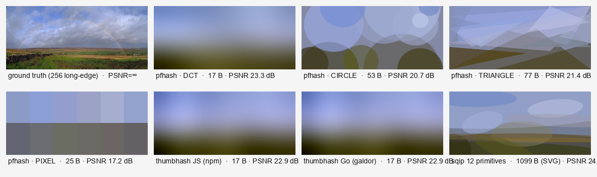
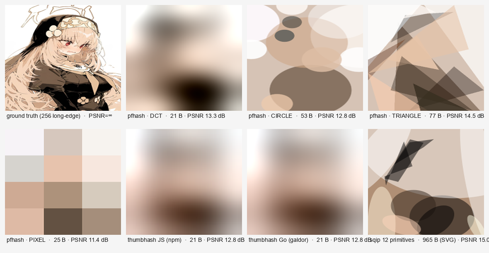

# Cross-implementation DCT/thumbhash benchmark

All measurements: 100×100 synthetic gradient input on the same machine.
`encode` is byte-out hash; `decode_*` is byte-in → RGBA pixel buffer.

**Hash spec note** — arthash DCT and thumbhash use *different* byte formats. Encoded sizes happen to be similar (17–24 B) but the hashes are NOT interchangeable. arthash decode targets `base_size=256`; thumbhash impls default to ~32 long-edge unless the API takes a size hint.

## Encode (100×100 → hash bytes)

| Implementation | Median | p95 | Hash bytes | MPix/s |
|---|---|---|---|---|
| thumbhash · Rust crate (evanw/thumbhash@0.1.0) | 308.0 µs | 493.7 µs | 24 | 32.5 |
| thumbhash · Go (go.n16f.net/thumbhash@1.1.0) | 414.6 µs | 625.5 µs | ? | 24.1 |
| thumbhash · JS (npm thumbhash@0.1.1) | 539.9 µs | 731.1 µs | 24 | 18.5 |
| arthash · PyO3 binding (Python→Rust) | 619.7 µs | 695.6 µs | 24 | 16.1 |
| arthash · Rust native (this crate, post-SGEMM) | 796.4 µs | 936.0 µs | 24 | 12.6 |
| arthash · Python pure (numpy + numba) | 908.3 µs | 1.16 ms | 24 | 11.0 |
| thumbhash · Python (PyPI thumbhash@0.1.2) | 25.16 ms | 28.29 ms | 24 | 0.4 |

## Decode (hash bytes → RGBA)

| Implementation | Output size | Median | p95 | MPix/s |
|---|---|---|---|---|
| arthash · Rust native (this crate, post-SGEMM) | 256 long-edge | 2.06 ms | 2.27 ms | 4.85 |
| arthash · PyO3 binding (Python→Rust) | 256 long-edge | 2.60 ms | 2.81 ms | 3.84 |
| arthash · Python pure (numpy + numba) | 256 long-edge | 2.70 ms | 4.16 ms | 3.70 |
| thumbhash · Go (go.n16f.net/thumbhash@1.1.0) | 256 long-edge | 12.22 ms | 15.80 ms | 0.82 |
| thumbhash · Rust crate (evanw/thumbhash@0.1.0) | default (~32) | 60.0 µs | 156.8 µs | 166.67 |
| thumbhash · JS (npm thumbhash@0.1.1) | default (~32) | 164.8 µs | 179.2 µs | 60.66 |
| thumbhash · Go (go.n16f.net/thumbhash@1.1.0) | default (~32) | 257.2 µs | 371.1 µs | 38.87 |
| thumbhash · Python (PyPI thumbhash@0.1.2) | default (~32) | 5.66 ms | 7.39 ms | 1.77 |

## Visual quality (PSNR vs ground truth at 256 long-edge)

`scripts/visual_compare.py <image>` produces a side-by-side decode of arthash 4 modes + thumbhash 2 impls + sqip on the same image.

### Landscape (Rainbow over Washfold, 1024×502)

| Output | Bytes | PSNR |
|---|---|---|
| sqip · 12 primitives (SVG) | ~1100 B | 24.4 dB |
| arthash · DCT | 17 B | **23.3 dB** |
| thumbhash · JS / Go | 17 B | 22.9 dB |
| arthash · TRIANGLE 12 | 77 B | 21.4 dB |
| arthash · CIRCLE 12 | 53 B | 20.7 dB |
| arthash · PIXEL 12 | 25 B | 17.2 dB |

### Anime (Pictoria 03, 410×600)

| Output | Bytes | PSNR |
|---|---|---|
| sqip · 12 primitives (SVG) | ~965 B | 15.0 dB |
| arthash · TRIANGLE 12 | 77 B | **14.5 dB** |
| arthash · DCT | 21 B | 13.3 dB |
| arthash · CIRCLE 12 / thumbhash | 53 / 21 B | 12.8 dB |
| arthash · PIXEL 12 | 25 B | 11.4 dB |

## Takeaways

**On algorithm parity** — arthash DCT and thumbhash produce visually indistinguishable thumbnails (≤0.5 dB PSNR gap) at nearly identical hash sizes (17 vs 17 B for landscape, 21 vs 21 B for anime). arthash DCT consistently scores slightly higher because the V4 codec adds Oklab + per-channel scale search + 5-bit L-scale (vs thumbhash's single-channel coarser quant).

**On encode speed** — thumbhash's Rust crate is **2.6× faster** than arthash Rust on encode (308 vs 796 µs). Reasons: thumbhash uses a smaller DCT support (~3×4) so the per-image arithmetic is roughly 1/4. The algorithms are essentially the same; the speed difference is purely about how many coefficients each codec keeps.

**On decode speed** — arthash Rust decode @ 256 (~2 ms) is **6× faster** than thumbhash Go forced to baseSize=256 (~12 ms). The thumbhash Go port uses a naive O(W·H·nx·ny) IDCT; arthash uses SGEMM. The thumbhash crate's native default (~32 px, then upscale via CSS) makes decode cost a non-issue in their design.

**On shape modes vs sqip** — sqip 12 primitives @ ~1 kB SVG produces visually richer placeholders (PSNR +3 dB over arthash CIRCLE 12, +9 dB over PIXEL) because it can use varied primitive types and arbitrary transforms. arthash CIRCLE/TRIANGLE trade quality for a 20× smaller hash (53–77 B vs ~1000 B SVG).

**On Python performance** — the third-party `thumbhash` PyPI package is **80× slower** than arthash Python on encode (25 ms vs 909 µs). It's pure-Python (no numpy/numba). For thumbhash-style hashing in Python, the arthash Python path is currently the fastest available — and the PyO3-bound version is **2× faster** still.
